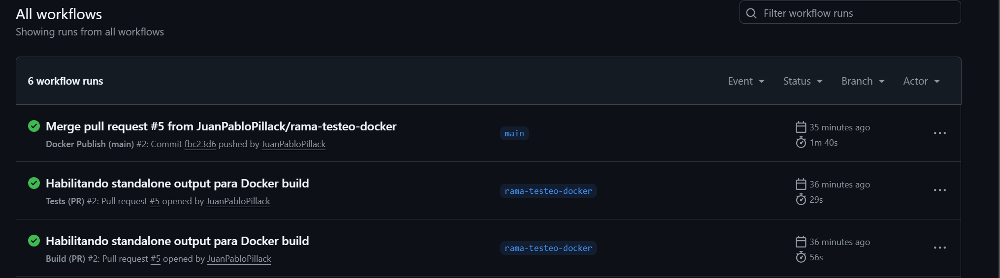

# Plataforma de Descubrimiento y Reseñas de Libros

Esta aplicación permite a los usuarios descubrir libros, explorar detalles, dejar reseñas y calificarlas. Está desarrollada con Next.js 15 y TypeScript, ofreciendo una experiencia moderna y eficiente para los amantes de la lectura.

# Características

Descubrimiento de Libros: Explora una lista de libros y accede a información detallada.

Reseñas: Crea reseñas con calificaciones.

CI/CD: Implementado con GitHub Actions para integración y despliegue continuo.
Docker: Soporte para despliegue en producción utilizando contenedores.

# Enlaces

Aplicación Deployada: http://resenas-app.vercel.app

Repositorio: http://github.com/JuanPabloPillack/Resenas-App

# Requisitos Previos

Node.js: Versión 18 o superior

npm o yarn para la gestión de dependencias

Docker (opcional, para ejecución en contenedores)

# Instalación y Ejecución Local

Clonar el Repositorio:
git clone https://github.com/JuanPabloPillack/Resenas-App

cd Resenas-App

# Instalar Dependencias si estas no están instaladas:
npm install
o
yarn install

# Ejecutar en Modo Desarrollo:
npm run dev
o
yarn dev

La aplicación estará disponible en http://localhost:3000.

# Variables de Entorno
Se necesita configurar el GITHUB_TOKEN para que el workflow de docker funcione correctamente

No se requieren variables de entorno críticas para la ejecución local. Si necesitas configurar variables (por ejemplo, NEXT_PUBLIC_API_KEY), agrégalas en un archivo .env.local

# CI/CD con GitHub Actions

1. Build en Pull Requests (build-pr.yml)

Descripción: Se ejecuta automáticamente en cada pull request.

Acciones:
Instala dependencias.
Realiza el build de la aplicación.
Falla si el build no es exitoso.

2. Tests en Pull Requests (test-pr.yml)

Descripción: Se ejecuta automáticamente en cada pull request.

Acciones:
Instala dependencias.
Ejecuta todos los tests unitarios con Vitest.
Falla si algún test no pasa.

3. Publicación de Imagen Docker (docker-publish.yml)

Descripción: Se ejecuta al mergear código en la rama main.

Acciones:
Construye una imagen Docker de la aplicación.
Publica la imagen en GitHub Container Registry (GHCR) con los tags latest y sha-<commit>.

# Ejecución con Docker

Descargar la Imagen:
docker pull ghcr.io/juanpablopillack/resenas-app:latest

Ejecutar la Aplicación:
docker run -p 3000:3000 ghcr.io/juanpablopillack/resenas-app:latest

Accede a la aplicación en http://localhost:3000.

# Estructura del Proyecto
plataforma-libros-despliegue/
├── .dockerignore
├── .gitignore
├── Dockerfile
├── eslint.config.mjs
├── next-env.d.ts
├── next.config.ts
├── package.json
├── postcss.config.mjs
├── README.md
├── tsconfig.json
├── vitest.config.ts
├── vitest.setup.ts
├── .github/
│   └── workflows/
│       ├── build-pr.yml
│       ├── docker-publish.yml
│       └── test-pr.yml
├── .next/
├── public/
├── screenshots/
├── src/
│   ├── __tests__/
│   ├── app/
│   ├── components/
│   └── lib/

# Demostraciones de Workflows

Build en Pull Requests: Verifica la integridad del build en cada PR.

Tests en Pull Requests: Garantiza la calidad del código mediante tests unitarios.

Docker Build & Publish: Automatiza la creación y publicación de imágenes Docker.

